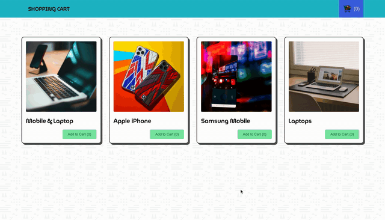

- Shopping Cart built in React using React States, Contexts and Reducer.
- To run the project:
    - Clone or Download the repo.
    - Go to the folder directory.
    - Run `npm install`
    - Used React svg component for image used.
    - Run react server `npm start`

